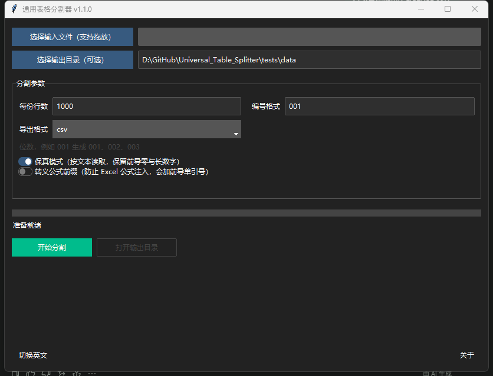

# Universal Table Splitter / 通用表格分割器

一款基于 Python 的跨平台表格分割工具：把一张大表按行数切成多个小文件。
同时提供 **GUI** 与 **CLI**，两者共用同一套核心逻辑，行为与错误提示完全一致。



---

## 功能亮点

**格式与数据质量**

- 📥 输入：CSV / TSV / Excel（`.xlsx` / `.xlsm` / `.xls`）/ JSON / JSON Lines，支持拖放
- 🔤 **编码自动探测**：BOM → UTF-8 → GB18030(GBK) → Big5 → CP1252 → Latin-1 回退。
  国内常见的 GBK 导出文件不再直接报 `UnicodeDecodeError`
- 🧬 **保真模式（默认开启）**：按文本读取，保留 `00123` 这样的前导零、避免 19 位长整数被转成
  科学计数法、避免整数列因空值变成 `1.0`
- 📄 **多工作表选择**：`.xlsx` 含多个 sheet 时自动出现下拉框，不再默默只处理第一个
- 🇨🇳 导出 CSV/TSV 时写入 **UTF-8 BOM**，Excel 打开中文不再乱码

**稳定与性能**

- ⚡ **体量自适应读取**：小于 64 MB 一次性载入（更快），超过则**流式分块**（内存占用与文件大小无关）
- 🛡️ 需要全量载入的格式（JSON / `.xls`）有体积上限；读取 xlsx 前校验解压比，防御解压炸弹
- 🧾 **原子写入**：先写 `.part` 临时文件再 `os.replace`，中途失败不会留下无法分辨的半成品
- 🛑 **真实取消**：协作式取消令牌贯穿预检与分块循环，随时中止且不再写文件；同一时刻只允许一个任务
- 🔁 同名文件策略：**覆盖** 或 **保留并加序号**（`_1`、`_2`），启动前告知将生成多少文件
- 🧯 完整堆栈写入日志，界面只显示一句可操作的中文/英文提示

**体验**

- 🌐 双语界面一键切换（运行中切换也不会丢进度文本）
- 🌓 主题自适应（Windows 读注册表的深色模式开关；macOS 读 `AppleInterfaceStyle`）
- 🏷️ 标题栏显示版本号（如 `通用表格分割器 v1.1.0`），打包后的 exe 属性里也带同一版本号
- 💾 记住上次的行数/编号/格式/目录
- 🔗 完成后给出摘要，并可一键打开输出目录

---

## 安装

### 运行环境

- Python **3.9 – 3.12**
- 需要 Tk（Windows/macOS 官方 Python 自带；Linux 需 `sudo apt install python3-tk`）

### 安装依赖

```bash
# 方式一：从源码安装（推荐，同时提供 table-splitter 命令）
pip install -e .

# 方式二：只要运行时依赖
pip install -r requirements.txt

# 可选：启用拖放支持
pip install tkinterdnd2

# 可选：开发工具（pytest / ruff / pre-commit / pyinstaller）
pip install -e ".[dev]"
```

> 各依赖都带兼容上界。`pandas` 2.0 移除了 `xlwt`，因此本项目**不再提供 `.xls` 导出**
> （旧版提供的该项功能会必然抛 `ValueError: No engine for filetype: 'xls'`）。

---

## 快速开始

### GUI

Windows 上最省事的方式是**双击 `run.bat`**（自动定位项目根目录、挑解释器、校验依赖，
图形界面用 `pythonw` 启动，不会多留一个黑窗口）。

也可以直接用命令：

```bash
run.bat                            # Windows：等价于下面的 GUI 启动
python splitter.py                 # 兼容旧用法
python -m universal_table_splitter # 等价
table-splitter-gui                 # 安装后可用
```

1. 选择或拖入要分割的文件（拖入**文件夹**会被当作输出目录）
2. 设置参数：每份行数、编号位数、导出格式（多 sheet 时选工作表）
3. 点击「开始分割」，运行中可随时取消

`run.bat` 还支持直接切分文件，把表格拖到脚本图标上即可：

```bat
run.bat 表格.csv -o 输出 -n 5000   :: 参数原样透传给命令行
run.bat --dry-run                  :: 只显示解析到的根目录与将要执行的动作
run.bat -- --help                  :: 「--」之后的内容交给程序解析
```

### CLI

```bash
# 基本用法：每 10 万行一个文件，导出 CSV 到 ./out
table-splitter big.csv -o out -n 100000

# 编号 001 起、导出 xlsx、中文提示
python -m universal_table_splitter data.csv -o out -n 5000 -d 001 -f xlsx --lang cn

# 多工作表 + 保留原文件（同名时自动加序号）
table-splitter book.xlsx --sheet "订单明细" --overwrite index

# 关闭保真模式（让 pandas 推断类型）、转义公式前缀
table-splitter data.csv --no-fidelity --escape-formulas

# 超大文件强制流式（内存有界）
table-splitter huge.csv -n 200000 --stream

# 运行中按 Ctrl+C 可安全中止；--clean-partial 会删除已生成的部分文件
table-splitter huge.csv --clean-partial
```

常用参数：

| 参数 | 说明 |
| --- | --- |
| `input` | 输入文件（CSV / TSV / Excel / JSON / JSONL） |
| `-o, --output` | 输出目录，默认与输入文件同目录 |
| `-n, --rows` | 每份行数，`1 – 1000000`，默认 `1000` |
| `-d, --digits` | 编号位数，默认 `001`（即 3 位）；超出位数会自然增宽（`999` → `1000`） |
| `-f, --format` | 导出格式：`csv` / `tsv` / `xlsx` / `json` / `html`，默认与输入同族 |
| `--sheet` | Excel 工作表名称 |
| `--no-fidelity` | 关闭保真模式，允许 pandas 自动推断列类型 |
| `--escape-formulas` | 给 `= + - @` 开头的单元格加前导 `'`，阻断 Excel 公式注入（**会修改单元格内容**） |
| `--overwrite` | `overwrite`（默认）或 `index`（保留原文件并加序号） |
| `--stream` | 强制流式读取 |
| `--clean-partial` | 取消/失败时删除已生成的文件 |
| `--lang` | `cn` / `en` |

---

## 行为与参数说明

### 关于「编号格式」

界面上的「编号格式」输入的是**编号位数**，`001` 表示生成 `001`、`002`…`010`。
它不是 Python 格式字符串，输入 `03d` 会被判为非法（这是 1.0 的文档与实际校验不一致之处，现已统一）。

### 关于「保真模式」

| | 开启（默认） | 关闭 |
| --- | --- | --- |
| 读取方式 | `dtype=str` + `keep_default_na=False` | 交给 pandas 推断 |
| `00123` | `00123` | `123` |
| `9007199254740993` | 原样 | 可能丢精度/变科学计数法 |
| 整数列含空值 | 原样 | 整列变 `float`，导出成 `1.0` |
| 空单元格 | 空字符串 | `NaN`（导出 CSV 为空） |

搬运数据时建议保持开启；需要让 Excel 把数字当数字用时再关闭。

### 关于性能

实测（Windows / Python 3.10 / pandas 2.3，`tests/data/danbooru_art_full.csv`，32.6 MB，
419,789 行 × 4 列，每份 10 万行）：

| 指标 | 数值 |
| --- | --- |
| 生成文件数 | 5 |
| 预检 + 写出总耗时 | ≈ 7.6 s（其中约 5.2 s 是 pandas `to_csv` 的固有开销） |
| 保真模式读取 | ≈ 1.6 s（反而比类型推断的 2.9 s 更快） |
| 一次性载入峰值内存 | ≈ 132 MB |
| 流式模式峰值内存 | 与文件大小无关，仅与分块大小相关 |

**取消/覆盖/残留**：写入是原子的（`.part` + `os.replace`），取消时不会留下半写的文件；
若已经写完若干文件，界面会询问是否删除它们。

### 日志与配置位置

| 内容 | Windows | macOS | Linux |
| --- | --- | --- | --- |
| 日志 | `%LOCALAPPDATA%\universal_table_splitter\logs\app.log` | `~/Library/Logs/universal_table_splitter/` | `~/.local/state/universal_table_splitter/logs/` |
| 设置 | `%APPDATA%\universal_table_splitter\settings.json` | `~/Library/Application Support/universal_table_splitter/` | `~/.config/universal_table_splitter/` |

---

## 架构

```
universal_table_splitter/
├── core/                 # 业务层：不 import tkinter，可被 CLI 与测试直接复用
│   ├── plan.py           #   纯函数：分块计划、编号、输入解析
│   ├── readers.py        #   编码探测 / 分隔符嗅探 / 流式读取 / 安全预检
│   ├── writers.py        #   导出注册表 / 原子写入 / 公式转义 / OS 错误翻译
│   ├── job.py            #   SplitJob + run_split：校验 → 预检 → 执行 → 进度 → 取消
│   └── deps.py           #   可选依赖自检
├── ui/                   # 界面层：只负责交互与渲染
│   ├── app.py            #   状态机、工作线程、队列驱动的事件循环
│   ├── theme.py          #   深色模式探测与 DPI 感知
│   └── widgets.py        #   文件选择组件、拖放 payload 解析
├── i18n.py               # 全部面向用户的文案（业务代码不允许硬编码自然语言）
├── settings.py           # 跨平台配置目录与偏好持久化
├── logging_setup.py      # 轮转日志 + 全局异常钩子
├── cli.py                # 命令行入口（复用 core）
└── __main__.py           # 无参数 → GUI；有参数 → CLI
```

关键约定：

- **业务层不依赖界面层**：`core` 里没有任何 `tkinter` 引用，因此可以被 `pytest` 完整覆盖；
- **错误只携带 i18n key**：`AppError("err.sheet_not_found", sheet="S2")`，文案由 UI/CLI 渲染；
- **取消是协作式的**：`threading.Event` 从预检一路传到分块循环，在块边界检查。

---

## 仓库结构

```
Universal_Table_Splitter/
├── run.bat                        # ★ 快速启动：自动定位项目根、校验环境、日志
├── splitter.py                    # 兼容入口（也是 PyInstaller 的入口脚本）
├── pyproject.toml                 # 项目元数据 + 依赖 + pytest/ruff 配置（唯一事实来源）
├── requirements.txt               # 仅运行时依赖，便于 `pip install -r`
├── README.md  CHANGELOG.md  LICENSE
├── .github/workflows/release.yml  # ★ 自动打包 + 自动发布（仅 Windows，不跑测试）
├── .pre-commit-config.yaml        # 提交前 ruff 检查与格式化
├── docs/
│   ├── CODE_REVIEW.md             # 1.0 → 1.1.0 的重构评估报告（归档，含验收清单）
│   ├── RELEASE.md                 # ★ 发布流程 + GitHub 侧配置清单（Splitter 令牌/权限）
│   └── screenshot.png             # 界面预览（打包版实拍）
├── packaging/
│   ├── build.bat                  # ★ 打包脚本：单文件 exe，支持 -o 输出目录 / -i 图标
│   ├── table_splitter.spec        # PyInstaller 配置（由 build.bat 调用）
│   └── output/                    # 打包产物与日志（默认输出目录，不进版本库）
├── universal_table_splitter/      # 源码（见上文「架构」）
└── tests/
    ├── data/README.md             # 大体积测试数据说明（数据本身不进版本库）
    └── test_*.py                  # 12 个测试文件
```

## 开发

```bash
pip install -e ".[dev]"          # 或 pip install -r requirements.txt

pytest                           # 211 个用例，约 15 秒
pytest -m slow                   # 另需 tests/data/danbooru_art_full.csv
pytest --cov=universal_table_splitter

ruff check .                     # 静态检查
ruff format .                    # 格式化
pre-commit install               # 提交前自动跑上面的检查
```

> 慢速集成测试依赖 30 MB 的真实数据集。把 `danbooru_art_full.csv` 放到 `tests/data/`
> 即可运行（获取方式与验证要点见 `tests/data/README.md`）；文件缺失时这 5 个用例会被跳过，
> 不影响其余用例。

> **关于两个 .bat 的编码（贡献者必读）**：`run.bat` 与 `packaging/build.bat` 是
> **GBK(cp936) + CRLF**，并且脚本内**故意不调用 `chcp`**。
> cmd.exe 按"当前控制台代码页"解码批处理文件，而 `goto`/`call` 按字节偏移跳转；
> 一旦在文件中途 `chcp`（例如 `chcp 65001`），先前算好的偏移会与新解码方式错位，
> cmd 会从某一行中间继续解析，把注释/命令尾部当命令执行，刷出一堆
> `is not recognized as an internal or external command`。
> 保持"文件编码 == 控制台代码页"即可彻底避免，中文 Windows 默认就是 936。
> **请勿把这两个文件另存为 UTF-8，也不要给它们加 `chcp`。**
> 若控制台代码页不是 936（例如 VS Code 默认的 UTF-8 终端），脚本会打印一行英文提示，
> 中文提示会显示为乱码，但功能完全正常。

测试重点覆盖了 1.0 版本中真实存在的缺陷，作为回归护栏：

| 用例 | 防护的缺陷 |
| --- | --- |
| `test_cancel_after_first_chunk_stops_writing` | 「取消」实际上不生效 |
| `test_start_operation_rejects_concurrent_worker` | 取消后再次点击会并发写同一批文件 |
| `test_xls_export_is_gone` | `.xls` 导出必然失败 |
| `test_windows_backslashes_are_not_escaped` | 拖放路径被 Tcl 转义破坏 |
| `test_gbk_file_is_readable` | GBK 中文 CSV 直接报错 |
| `test_csv_is_written_with_bom` | 中文 CSV 在 Excel 中乱码 |
| `test_fidelity_keeps_leading_zeros` | 前导零/长数字静默失真 |
| `test_multi_sheet_selection` | 多 sheet 只读第一个 |
| `test_atomic_write_leaves_no_temp_file_on_failure` | 失败留下残渣文件 |
| `test_language_switch_keeps_live_progress_text` | 运行中切换语言丢失进度 |
| `test_all_keys_referenced_in_code_exist` | 错误文案中英混杂 |

---

## 打包为独立可执行文件

使用打包脚本（自动处理依赖检测、图标、输出目录与日志）：

```bat
packaging\build.bat                       :: 打包到 packaging\output\dist
packaging\build.bat -o D:\发布             :: 自定义输出目录
packaging\build.bat -i assets\app.ico      :: 指定图标
packaging\build.bat -n 表格分割器           :: 指定 exe 名称
packaging\build.bat --no-clean             :: 复用构建缓存，重打包更快
packaging\build.bat --dry-run              :: 只看将要执行什么，不真正打包
packaging\build.bat -h                     :: 查看全部选项
```

特点：

- **单个 exe**，已内置 Python 与全部依赖（pandas / openpyxl / ttkbootstrap 等），
  可直接拷到没装 Python 的 Windows 机器运行；exe 的属性里带版本号（与标题栏同源）；
- 首次打包约 2–5 分钟，体积约 50–150 MB（pandas 占大头）；
- 输出目录、临时目录、图标、exe 名称都可自定义；相对路径按**项目根目录**解析，
  双击运行也不会把产物丢到系统目录；
- 完整构建输出实时打印并写入 `<输出目录>\build.log`；失败时脚本会打印日志尾部，
  并区分「包未安装」「图标缺失」「构建失败」「产物未生成」等原因；
- 打包前自动检查 Python 版本、运行时依赖与 PyInstaller，缺失时询问是否安装
  （`--no-install` 可关闭询问）。

> 也可以直接使用 spec：`pyinstaller packaging/table_splitter.spec`。
> 由于 PyInstaller 在读入 `.spec` 后会忽略 `--icon`/`--name` 等命令行选项，
> 脚本改用环境变量 `UTS_ICON` / `UTS_APP_NAME` 把这两项传给 spec。

---

## 发布新版本（自动化）

GitHub Actions 只负责**打包与发布，不运行任何测试**。打一个标签即可完成全流程：

```bash
# 1) 先改版本号（唯一来源）
#    universal_table_splitter/__init__.py -> __version__ = "1.1.0"
# 2) 推标签，剩下的交给 Actions
git tag -a v1.1.0 -m "1.1.0"
git push origin v1.1.0
```

Actions 会自动：打包 Windows 单文件 exe → 构建 wheel/sdist → 创建 Release 并附上全部产物与
SHA256 校验和。所有作业都跑在 `windows-latest` 上，**不在 Ubuntu 上打包、不产出任何 Linux 制品**。
标签与 `__version__` 不一致时会直接失败并提示，避免版本错配。

发布使用仓库 Secret **`Splitter`**（`${{ secrets.Splitter }}`）作为令牌，未配置时自动回退到
内置 `GITHUB_TOKEN`，日志里会打印实际使用的来源。也可以在 `Actions → Release → Run workflow`
手动触发（在分支上触发只产出构建物、不建 Release）。首次使用前建议先配好该 Secret，
完整清单见 [docs/RELEASE.md](docs/RELEASE.md)。

---

## 已知限制

- Excel 读取依赖 openpyxl / xlrd，**单元格格式、公式、合并单元格不会被保留**
  （xlsx 以 `data_only=True` 读取，公式取缓存值）；
- `.xls`（旧版）只能读取，不能导出；
- 导出 HTML 是静态表格，不含样式与 JavaScript；
- xlsx 写入速度受 openpyxl 限制，行数很多时建议导出 CSV/TSV；
- `--escape-formulas` 会给单元格加前导 `'`，Excel 中会看到这个字符，属预期行为；
- 打包环境中 ttkbootstrap 的 `round-toggle` 布局可能注册失败，此时程序会**逐级降级**
  （圆形开关 → 平面按钮样式 → 原生勾选框）并在日志中记录告警。
  界面美化任何时候都不会成为启动失败的理由。

---

## 常见问题

**Q：中文变成乱码？**
导出 CSV 已带 UTF-8 BOM，Excel 可正常识别。如果仍乱码，请确认不是用旧版本生成的文件，
或改用 xlsx 导出。

**Q：提示「无法识别文本编码」？**
文件可能是少见编码，请用记事本/Notepad++ 另存为 UTF-8 或 GBK 后重试。

**Q：导出 Excel 时报缺少依赖？**
`pip install openpyxl`。程序启动时也会检测并提前提示。

**Q：界面显示乱码？**
Linux 需安装中文字体（如 `fonts-noto-cjk`）；Windows/macOS 默认支持。

**Q：拖放没反应？**
源码运行需要 `pip install tkinterdnd2`（或 `pip install -e ".[dnd]"`），未安装时启动会提示，
仍可继续用「选择输入文件」按钮。**打包好的 exe 已内置拖放支持**、不需要另装；
若 exe 仍提示缺少该依赖，说明那个发布版本漏装了可选依赖（1.1.0 存在此问题），请换用更新版本。

**Q：想批量/自动化处理？**
用 CLI（见上文），或直接调用 `universal_table_splitter.core.run_split`。

---

## English quick start

```bash
pip install -e .
python -m universal_table_splitter            # GUI
table-splitter data.csv -o out -n 100000      # CLI
```

Key behaviours: automatic encoding detection (UTF-8 / GBK / Big5 / …), fidelity mode on by
default (keeps leading zeros and long integers as text), streaming reads for files over 64 MB,
BOM-tagged CSV output for Excel, real cooperative cancellation, atomic writes, and identical
logic/validation between the GUI and the CLI (`--lang en` for English messages).

---

## 变更日志与许可证

- [CHANGELOG.md](CHANGELOG.md)：1.1.0 是一次以健壮性为核心的重构，逐条对应
  [docs/CODE_REVIEW.md](docs/CODE_REVIEW.md) 中的评估结论
- 许可证：[GNU Affero General Public License v3.0](LICENSE)

Powered by StarAsh042
